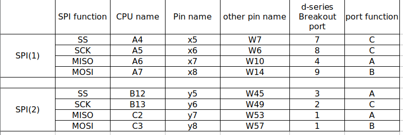

# TreadmillTasks

Spherical treadmill task based on the [PyControl](https://pycontrol.readthedocs.io/en/latest/) framework running on the series-d micropython [breakout board](https://karpova-lab.github.io/pyControl-D-Series-Breakout/).

Follow the naming conventions specified [here](/tasks/conventions.md).

## Behavioural ports

Here is the pinout of the behavioural ports:  

Specifically, the SPI pins are spread out as follows:  

